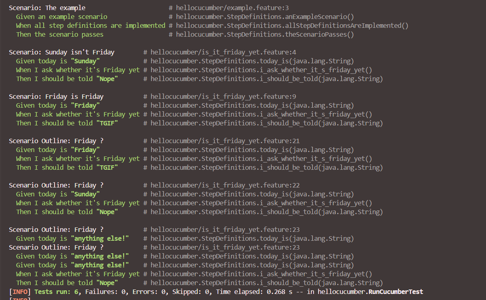

= R5.A.08 -- Dépôt pour les TPs
:icons: font
:MoSCoW: https://fr.wikipedia.org/wiki/M%C3%A9thode_MoSCoW[MoSCoW]

Ce dépôt concerne les rendus de mailto:angelo.nichele@etu.univ-tlse2.fr[Angelo Nichele].

== TP1

.Exemple de code
[source,java]
---
@Given("today is {string}")
    public void today_is(String d) {
        this.today = d;
    }
@When("I ask whether it's Friday yet")
public void i_ask_whether_it_s_friday_yet() {
    this.actualAnswer = IsItFriday.isItFriday(today);
}
@Then("I should be told {string}")
public void i_should_be_told(String expectedAnswer) {
    assertEquals(expectedAnswer, actualAnswer);
}
---

.is_it_friday_yet.feature
[source,feature]
---
Feature: Is it Friday yet?
    Everybody wants to know when it's Friday
---
  Scenario: Sunday isn't Friday
    Given today is "Sunday"
    When I ask whether it's Friday yet
    Then I should be told "Nope"
---
  Scenario: Friday is Friday
    Given today is "Friday"
    When I ask whether it's Friday yet
    Then I should be told "TGIF"
---
  Scenario Outline: Friday ?
    Given today is "<day>"
    When I ask whether it's Friday yet
    Then I should be told "<answer>"
---  
  Examples:
    | day            | answer |
    | Friday         | TGIF   |
    | Sunday         | Nope   |
    | anything else! | Nope   |

---

.Résultats du TP1

== TP2...
